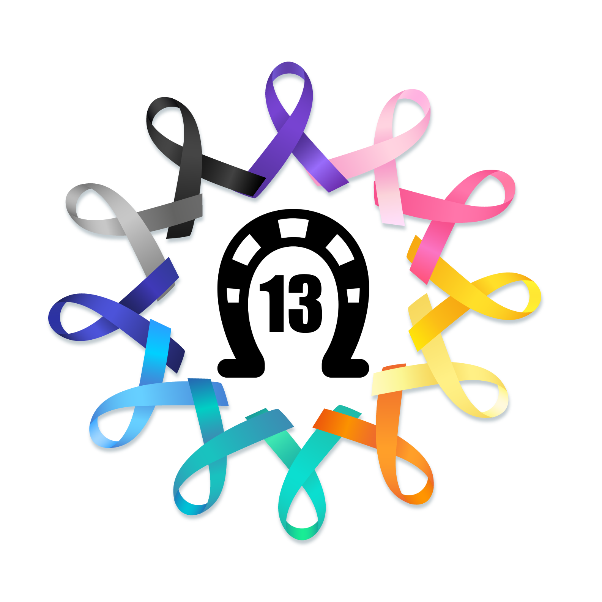

# Colônia Treze Against Cancer, a front end exercise

This front-end project is part of my final evaluation in a package of integrated courses from the University of Michigan, called "Web Design for Everybody: Basics of Web Development & Coding", which was offered by the Coursera platform.

**This is the link to the course:** [Web Design for Everybody: Basics of Web Development & Coding](https://www.coursera.org/specializations/web-design)

This project is a portfolio in which I chose to define as a theme a research and extension project in which I participated during high school, called Colônia Treze Against Cancer, which developed several activities in my region.

# About the avaliation

These were the evaluation criteria for passing the final course work, and I passed all of them with the highest score:

1. Does the site validate?
2. Is the site responsive?
3. Is the site well-styled?
4. Are the images incorporated effectively?
5. Successfully demonstrated the ability to enhance their site?

# The certificate of completion of the integrated course package

# Individual certificates for each course

